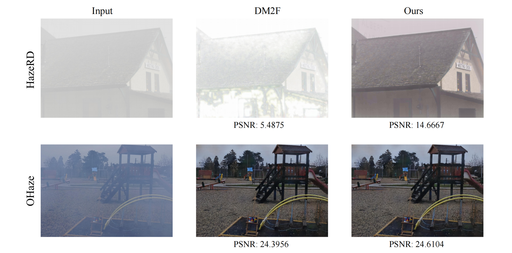

# DM2F-Enhancing
Final Dehazing Project of Digital Image Processing (COMP130032): 
    Improvemnt of [DM2F-Net](https://github.com/zijundeng/DM2F-Net).

<div style="text-align:center">
    
</div>

## Installation
1. Clone our repository
```
git clone https://github.com/linghuyuhangyuan/DM2F-Enhancing.git
cd DM2F-Enhancing
```

2. Make conda environment
```
conda create -n DM2F python=3.8
conda activate DM2F
```
```
pip install -r requirements.txt
```

## Data Preparation
- [HazeRD](https://labsites.rochester.edu/gsharma/research/computer-vision/hazerd/)
- [OHaze](https://data.vision.ee.ethz.ch/cvl/ntire18//o-haze/)

Please put them in the `data` directory.

## Pretrained model
Download pretrained model from [Google Drive](https://drive.google.com/drive/folders/1YethsBHO103rDu_7wDJDlcisshxzg216?usp=sharing) and place them in the `ckpts` directory.

## Training
```
python train_alg1.py --gpus 0 \
    --load-dm2f ckpts/ckpt/O-Haze/iter_20000_loss_0.04937_lr_0.000000.pth \
    --ckpt-path ckpts/ckpt_alg1
```
Before training algorithm 1, assume that pretrained model has been put in the `ckpts` directory.

```
python train_alg2.py --gpus 1 \
    --ckpt-path ckpts/ckpt_alg2
```

## Evaluation
Before testing, assume that pretrained model has been put in the `ckpts` directory.
```
python test_alg1.py
```

```
python test_alg2.py
```

## Contact
If you have any question or suggestion, please contact ltzhang21@m.fudan.edu.cn.